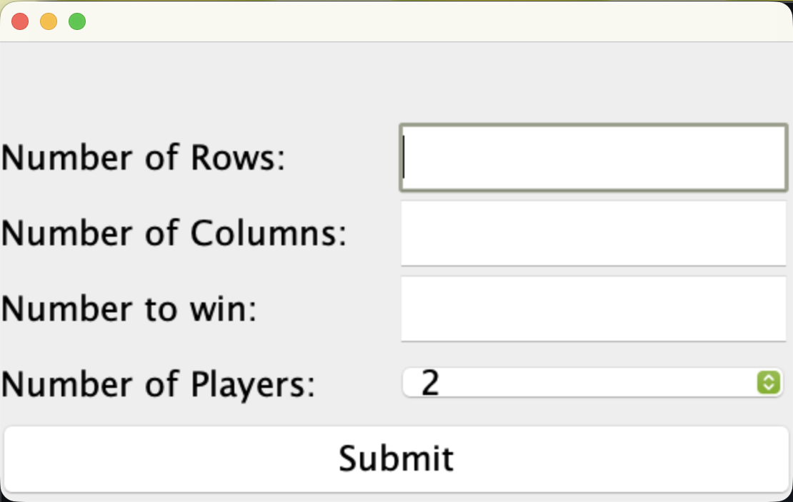
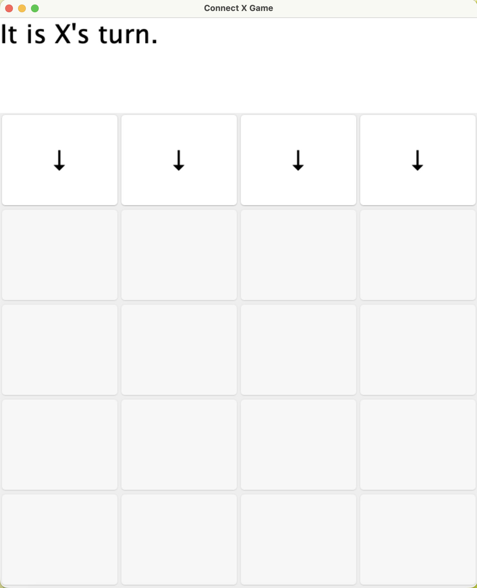
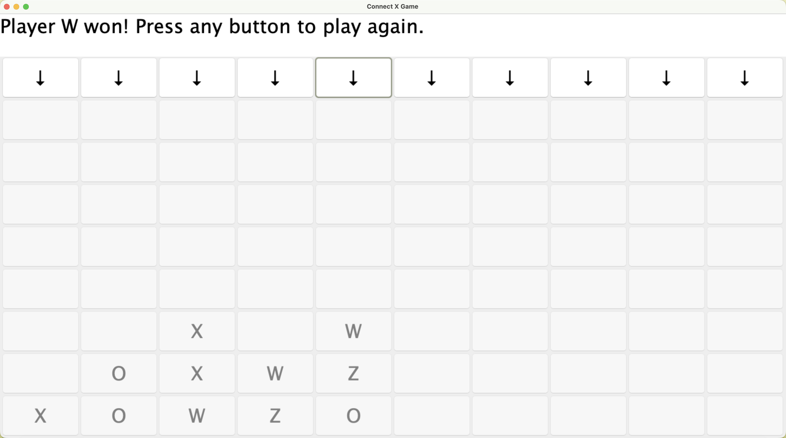
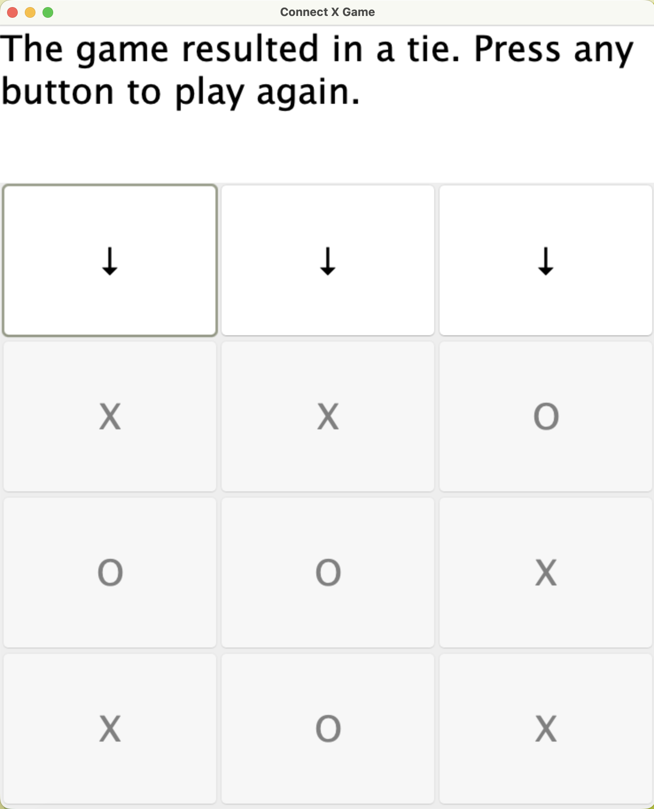

# Connect Game with Graphical User Interface

A Java implementation of the classic Connect Four game with customizable game settings. Players can configure the number of rows, columns, players, and the number of consecutive pieces required to win before starting a game. The project demonstrates object-oriented design principles, graphical user interface development, and the Model-View-Controller (MVC) architecture.

## Features

- Customizable board dimensions
- Support for 2–10 players
- Configurable win condition (Connect X)
- Graphical user interface built with Java Swing
- Input validation with user-friendly error messages
- Turn-based gameplay
- Win and tie detection

## Getting Started

### Option 1: Download the Executable (Recommended)

Download the latest executable JAR from the **Releases** section and run:

```bash
java -jar ConnectX.jar
```

### Option 2: Build from Source

```bash
cd src
javac *java
java ConnectXApp
```
## Screenshots





## Technologies Used

- Java
- Java Swing
- MVC (Model-View-Controller)
- Object-Oriented Programming (OOP)

## Concepts Learned

This project strengthened my understanding of:

- Object-oriented programming principles
  - Abstraction
  - Encapsulation
  - Inheritance
  - Polymorphism
- Designing applications using the MVC architectural pattern
- Building desktop applications with Java Swing
- Event-driven programming using ActionListeners
- Creating responsive graphical user interfaces
- Input validation and exception handling
- Managing game state and game logic
- Working with interfaces and abstract classes
- Implementing reusable and maintainable code

## Project Structure

```
src/
├── ConnectXApp.java
├── SetupView.java
├── SetupController.java
├── GameBoardView.java
├── GameBoardController.java
├── ...
```

The project follows the MVC design pattern:

- **Model** – Stores the game board, player information, and game logic.
- **View** – Java Swing user interfaces for the setup screen and game board.
- **Controller** – Handles user input and coordinates communication between the model and views.

## What I Learned

This project provided hands-on experience designing a medium-sized Java application from the ground up. I learned how to separate application logic from the user interface using MVC, create interactive desktop applications with Java Swing, validate user input, and organize code into reusable classes. It also reinforced best practices for object-oriented software design and event-driven programming.

## Future Improvements

- AI opponent
- Custom player names
- Theme customization
- Undo move functionality
- Improved animations and visual effects
